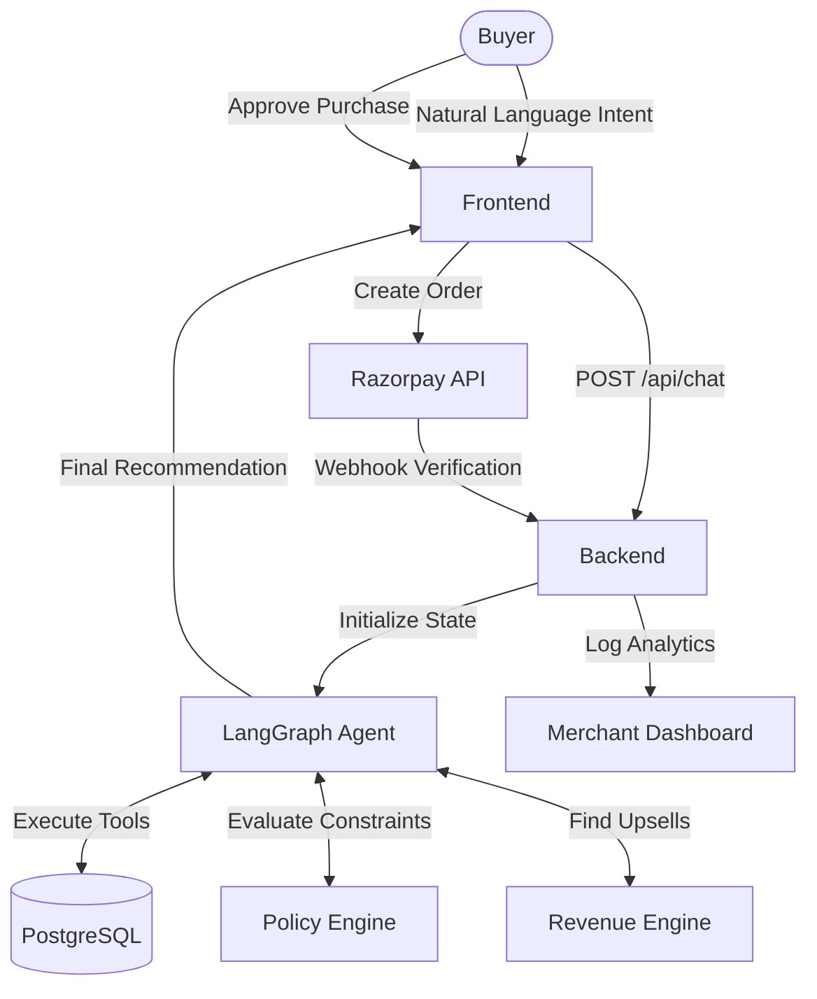

# Agentic Commerce: Complete Project Overview & Testing Guide

This guide provides a comprehensive overview of how the entire Agentic Commerce platform is structured, followed by a highly detailed, step-by-step testing script for your hackathon presentation.

---

## 🏗️ 1. How the Full Project Works (Architecture & Flow)

The platform is designed to replace traditional keyword-based "Search & Browse" with an **AI-Native Commerce Network** powered by autonomous agents. 

### Core Components

1. **Frontend (Next.js 14, Tailwind CSS, Recharts)**
   - **Merchant Dashboard (`/`)**: A real-time executive dashboard for merchants. It displays standard metrics (Revenue, Orders) alongside **AI Commerce metrics** (AI-generated GMV, AI Conversion Rates, and the AI Decisions Feed).
   - **AI Buyer Interface (`/buyer`)**: A conversational interface where the customer interacts with the AI Agent. It simulates the buying experience.

2. **Backend (FastAPI, PostgreSQL, SQLAlchemy)**
   - Houses the `Commerce Tool Layer`: A structured set of APIs exposing catalogs, inventory, and carts to the AI.
   - Manages the entire PostgreSQL database (Products, Orders, Customers, Agent Decisions, Audit Logs).

3. **AI Agent (LangGraph, LangChain, Google Gemini 3.6 Flash)**
   - Acts as the core brain. Instead of hardcoded intent trees, we use a `StateGraph` where the LLM dynamically decides which tools to call based on the user's conversation.
   - Uses `gemini-3.6-flash` for high-speed, accurate reasoning.

4. **Revenue Intelligence & Policy Engines**
   - **Revenue Engine**: Deterministically scores cross-sell and upsell opportunities. (e.g., if buying a laptop, recommend a mouse).
   - **Policy Engine**: Enforces merchant rules (e.g., maximum discount limits, cart total validation) before an order is placed.

5. **Payments (Razorpay Integration)**
   - When the user agrees to buy, the backend generates a Razorpay order. The frontend securely processes the payment via the Razorpay Checkout modal in Test Mode. Webhooks verify the transaction.

### The Data Flow

---

## 🧪 2. Step-by-Step Testing & Demo Script

Follow these exact steps to demonstrate the full power of the platform to the judges.

### Preparation Phase
1. Start the PostgreSQL database and ensure it's running. 
   - *Tip: You can verify it's running on port 5432 by running `pg_isready` or `sudo systemctl status postgresql` in your terminal.*
2. Start the backend: `cd backend && source venv/bin/activate && uvicorn app.main:app --reload`
3. Start the frontend: `cd frontend && npm run dev`
4. Open two windows side-by-side:
   - **Left Window:** `http://localhost:3000` (Merchant Dashboard)
   - **Right Window:** `http://localhost:3000/buyer` (AI Buyer Interface)

### Step 1: Reset the Environment (Start Clean)
1. On the Merchant Dashboard (Left Window), click the **"Reset Demo Data"** button in the sidebar.
2. *Talking Point:* "We are starting with a clean slate. The platform automatically seeds 3 demo merchants, products, and baseline analytics."

### Step 2: Show the Merchant Dashboard
1. Point out the standard metrics vs. **AI Commerce metrics**.
2. *Talking Point:* "Merchants don't need to rebuild their websites. They expose their catalog to our network, and this dashboard shows them exactly how much revenue the AI is generating for them."

### Step 3: Demonstrate Intent Parsing (AI Buyer UI)
1. Switch to the AI Buyer Interface (Right Window).
2. Select a Customer Persona from the dropdown (e.g., **Ananya**).
3. **Type this exact prompt:** 
   > *"I need a birthday gift for my brother who loves gaming. My budget is strictly under ₹4,000. It needs to have fast delivery. What do you recommend?"*
4. *Talking Point:* "Notice how this isn't a Google Search. The AI is parsing intent: Gift, Gaming, Budget < ₹4k, Fast Delivery."

### Step 4: The Agentic Discovery
1. The AI will respond, recommending a specific product (e.g., *K01 Mechanical Gaming Keyboard for ₹3,499*).
2. *Talking Point:* "Behind the scenes, the LangGraph agent autonomously queried the database, checked inventory, compared delivery times, and ranked the best offer across all participating merchants."

### Step 5: The Revenue Intelligence Upsell
1. **Type:** 
   > *"That looks perfect. I'll take it."*
2. The AI will respond by suggesting an add-on. (e.g., *"Since it's for gaming, would you also like to add the G502 Gaming Mouse for ₹2,499?"*)
3. *Talking Point:* "Before checking out, our Revenue Intelligence Engine triggers a deterministic cross-sell based on product synergy."

### Step 6: Policy Enforcement & Checkout
1. **Type:** 
   > *"Yes, add the mouse too and let's buy."*
2. The AI will confirm the final cart total (₹5,998) and ask to proceed to payment.
3. *Talking Point:* "The agent just ran the Policy Engine to ensure the total and margins are compliant with the merchant's rules. Now it's ready for Razorpay."
4. **Type:** 
   > *"Yes, proceed to payment."*

### Step 7: Razorpay Payment
1. The **Razorpay Checkout Modal** will appear on the screen.
2. Enter the test card details:
   - **Card Number:** `4111 1111 1111 1111`
   - **Expiry:** Any future date (e.g., `12/26`)
   - **CVV:** `123`
3. Click Pay. Wait for the success confirmation.

### Step 8: The "Aha!" Moment (Closing the Loop)
1. Switch back to the **Merchant Dashboard** (Left Window).
2. Refresh the dashboard.
3. **Point out the changes:**
   - The **Revenue** has increased instantly.
   - The **Activity Feed** shows the new Razorpay transaction.
   - The **AI Decisions Feed** shows exactly *why* the AI recommended the keyboard and the mouse, giving the merchant full transparency into the AI's reasoning.
4. *Closing Statement:* "This proves the value of Agentic Commerce. The AI handled discovery, upselling, policy enforcement, and checkout—all autonomously, while the merchant retained full visibility and control."
